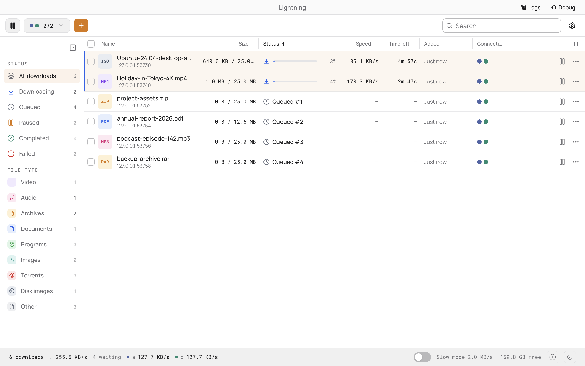
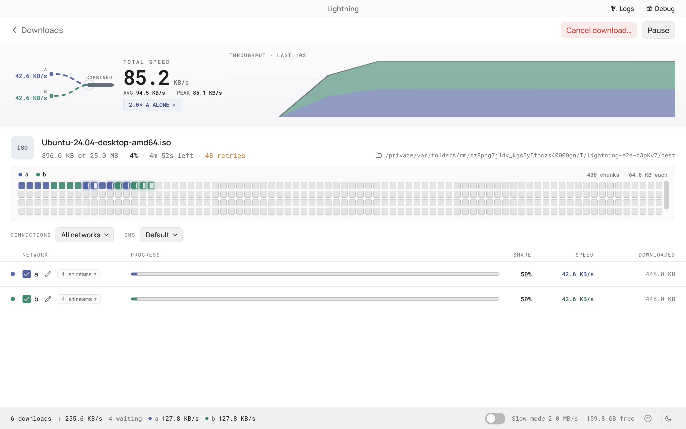

<p align="center">
  
</p>

<h1 align="center">Lightning</h1>

<p align="center">
  <strong>The download manager that uses every network you have, all at once.</strong><br />
  Wi-Fi, Ethernet, a tethered phone and a VPN can all carry the same file at the same time.
</p>

<p align="center">
  <a href="https://github.com/alisinaee/Lightning/releases"></a>
  
  
</p>

<p align="center">
  
</p>

---

## Why Lightning

One connection rarely uses all the bandwidth you have. Your computer sends all its traffic out through a single default route, so a second network sits idle even when it is connected.

Lightning splits a file into ranges and fetches each range through a specific network interface, in parallel. The pieces are joined as they arrive, and the file is written once, straight into its final place.

```text
                 ┌── Wi-Fi ────────┐
                 │                 │
 File ──▶ split ─┼── USB tether ───┼──▶ one finished file
                 │                 │
                 └── Ethernet ─────┘
```

Faster networks take more pieces, so a slow one never holds the others back.

## Features

### Downloading

- **Several networks per download.** Choose **All**, **Auto**, or individual networks (Wi-Fi, LAN and so on) for a single download, a group, or the whole app. The networks menu shows how many are active, for example `2/2`.
- **Direct links, magnet links and `.torrent` files.** For torrents, tick the files you want first, then watch peers, pieces and speed.
- **Groups.** Add several files at once and choose how many run together (1, 2, 5…). In **Auto** mode the last file left uses every network for top speed. In **Manual** mode set one rule for all files, or one per file.
- **Download later.** Add a file paused and start it when you like.
- **Fix a dead link.** Paste a fresh link to the same file and carry on from where it stopped.
- **Safe resume.** Pause, quit, relaunch and continue. Lightning checks the server's `ETag` and `Last-Modified` first, and refuses to resume a file that has changed rather than corrupt it.
- **Self-healing.** Failed pieces are retried with backoff, silent connections are replaced, and a network that changes address or wakes from sleep reconnects at once.

### Control

- **Limits.** Cap total speed, switch on slow mode, or give each network its own speed and daily, weekly or monthly data limit.
- **DNS, with a test.** Pick DNS servers for the app, a group or one download, from a list that includes well-known Iranian ones (Electro, Shecan, Begzar and more). **Test DNS for this site** tries every DNS on a link's real host and measures the servers they lead to. **Auto** uses the best one found for each site. A DNS that sends a site to a server with the wrong certificate is flagged and never chosen.
- **Proxy.** Use the system proxy, none, or a manual HTTP, HTTPS, FTP or SOCKS5 proxy for the app's own requests.
- **VPN.** Lightning detects your VPN and lets you switch whether downloads may use it, from the top bar.
- **Power.** Keeps the computer awake while a download runs.
- **Schedule.** Weekly run or pause windows (overnight ones too), each with an optional speed cap.
- **When downloads finish.** Optionally ask whether to quit, sleep or shut down; a file can also open itself, or show in its folder, when done.
- **Sign-in, cookies and headers.** Basic auth (or `user:pass@` in a link), a Referer, cookies (paste or import `cookies.txt`), a User-Agent and extra headers per download. They are never sent on to another host after a redirect.
- **Checksums.** Paste a SHA-256, SHA-1 or MD5 and the finished file is verified.
- **Browser extension.** Chrome, Edge, Brave and Firefox can hand downloads to Lightning (see `extension/`).
- **Extras.** Start at login (hidden in the tray) and offer to download links you copy.

### Your list

- **Sidebar filters** by status (Downloading, Queued, Paused, Completed, Failed) and by file type: video, audio, archives, documents, programs, images, torrents, disk images.
- **File-type badges** (`MP4`, `RAR`, `ISO`…) in a colour for each kind, and a tinted row, sorted to the top, for anything in progress.
- **Resizable, sortable columns** and search with previous/next and a counter such as `1/23`. Long names can wrap onto several lines.
- **Right-click or `⋯` on any row** for open, show in folder, details, pause/resume/retry, fix link, copy link, copy name or location, download again, remove from list, delete file, or cancel and delete partial data. Anything destructive asks first, and bulk actions apply to the whole selection.
- **A status bar** with the count, total speed and the speed of each network.

<p align="center">
  
</p>

Open any download to see its speed over time, what each network contributed, and a map of every chunk coloured by the network that fetched it.

### History and settings

- **History** keeps every finished file with search, size, date, uploaded bytes and a mark when the file has gone missing. Rename a file (on disk too, if it is still there), show it in Finder or Explorer, remove it from history only, or clear the lot.
- **Settings** has General, History, Appearance (text size, light or dark, accent colour), Network, Notifications, Power and Interface (close to the tray, hide the Dock icon).
- **Logs window and diagnostic report** with sensitive details redacted, for when something goes wrong.

## Install

Download the latest build from [Releases](https://github.com/alisinaee/Lightning/releases). Lightning checks the same page for updates.

Builds are unsigned. On macOS, right-click the app and choose **Open** the first time. An app you build yourself launches without that prompt.

## Getting the most from several networks

Combining networks only helps when each one has its **own route to the internet**.

- Use genuinely different connections, such as home Wi-Fi plus a phone's USB or hotspot tethering. Wi-Fi and Ethernet plugged into the *same router* share one upstream link and add nothing.
- **Windows:** if Wi-Fi drops when Ethernet is plugged in, open `gpedit.msc`, go to *Computer Configuration → Administrative Templates → Network → Windows Connection Manager* and set *Minimize the number of simultaneous connections to the Internet or a Windows domain* to **Disabled**.
- **Android USB tethering on macOS:** macOS has no RNDIS driver. Install [TetherKit](https://github.com/XiaoMiku01/TetherKit) with `brew install XiaoMiku01/tap/tetherkit`, turn on USB tethering on the phone, and the interface appears in Lightning.
- Lightning can only use connections your operating system exposes as network interfaces. VPN and virtual adapters show up too, so check each network's speed on the details page.

## How it works

1. **Probe.** A range request learns the file size, whether the server allows `206 Partial Content`, and its validators.
2. **Chunk.** The file is cut into chunks of up to 8 MB and written directly into the destination, with no second copy.
3. **Bind.** Worker connections are bound to specific network interfaces. Each interface starts with 8 and grows up to 32 while the server keeps accepting them. It drops back when the server refuses.
4. **Steal work.** Chunks come from a shared queue, so fast networks do more of the work.
5. **Recover.** Failed chunks go back in the queue, and connections that go silent for 20 seconds are replaced.

## Build from source

You need Node.js 22.12 or later and npm 9 or later.

```bash
git clone https://github.com/alisinaee/Lightning.git
cd Lightning
npm install
npm run dev
```

Package an app:

```bash
npm run build:mac
npm run build:win
npm run build:linux
```

Output goes to `dist/`.

## Testing

```bash
npm run typecheck
npm run lint
npm run test:e2e:smoke   # quick smoke tests
npm run test:e2e         # full Playwright suite, including integrity and chaos tests
```

See [CONTRIBUTING.md](CONTRIBUTING.md) and [docs/TESTING.md](docs/TESTING.md).

## Built with

Electron, React 19, TypeScript, Tailwind CSS v4, Base UI, Zustand, WebTorrent, electron-vite, electron-builder and Playwright.

## Licence

MIT. See [LICENSE](LICENSE).
